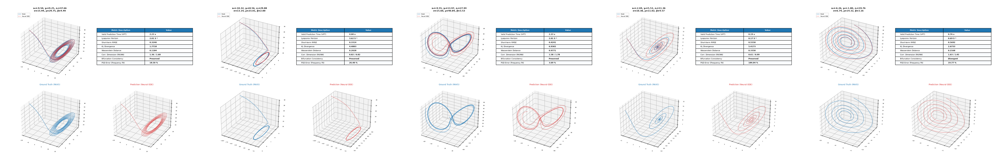

# Lorenz-63 Generator Neural ODE

A Physics-Informed Neural Ordinary Differential Equation (Neural ODE) framework that models continuous-time parametric Lorenz-63 dynamical systems on a 6D augmented manifold ($\mathbf{q} = [x, y, z, \sigma, \rho, \beta]^T$). The architecture utilizing a differentiable Heun (RK2) integrator and a dynamic horizon Model Predictive Control (MPC) loss function.

  

## Project Overview

The system takes initial dynamic states $\mathbf{x}_0 = [x_0, y_0, z_0]^T$ and static system parameters $\mathbf{p} = [\sigma, \rho, \beta]^T$ as inputs to predict continuous phase-space trajectories over a defined time horizon $T$.

Rather than utilizing explicit differential equations during inference, the framework passes the augmented initial state $\mathbf{q}_0 = [\mathbf{x}_0^T, \mathbf{p}^T]^T$ into a neural vector field network $f_\theta(\mathbf{x}, \mathbf{p}) \approx \frac{d\mathbf{x}}{dt}$. A differentiable Heun (RK2) numerical integrator sequentially steps through the vector field at step size $\Delta t$, rolling out multi-step trajectory predictions $\hat{\mathbf{X}} \in \mathbb{R}^{T \times 3}$.

The generated rollout provides continuous trajectory estimates across chaotic parameter regimes, enabling direct benchmark evaluations against ground-truth Runge-Kutta (RK45) solutions.

## Mathematical Model

### Governing Lorenz-63 System Dynamics
The system's ground-truth continuous-time behavior is governed by the 3D parametric Lorenz-63 differential equations:

$$\frac{dx}{dt} = \sigma (y - x)$$

$$\frac{dy}{dt} = x (\rho - z) - y$$

$$\frac{dz}{dt} = x y - \beta z$$

where $\mathbf{x}(t) = [x, y, z]^T \in \mathbb{R}^3$ represents the dynamic state trajectory in phase space, and $\mathbf{p} = [\sigma, \rho, \beta]^T \in \mathbb{R}^3$ denotes the static physical system parameters (representing Prandtl number, Rayleigh number, and geometric factor, respectively).

### Vector Field Approximation via Neural ODE
Instead of executing explicit symbolic integration during prediction, a neural vector field network $f_\theta(\mathbf{x}, \mathbf{p})$ is parameterized to approximate the underlying autonomous velocity field over an augmented 6D manifold $\mathbf{q} = [\mathbf{x}^T, \mathbf{p}^T]^T$:

$$\frac{d\mathbf{x}}{dt} \approx f_\theta(\mathbf{x}, \mathbf{p})$$

The continuous dynamics are rolled out across discrete time steps $\Delta t$ using a differentiable numerical scheme:

$$\mathbf{x}_{k+1} = \text{Integrator}\left(\mathbf{x}_k, \mathbf{p}, f_\theta, \Delta t\right)$$

### Deterministic Chaos & Prediction Horizon Challenges
Modeling the Lorenz-63 system presents significant learning challenges due to its sensitive dependence on initial conditions when operating in chaotic parameter regimes (e.g., $\sigma = 10, \rho = 28, \beta = 8/3$):

* **Exponential Trajectory Divergence:** Minor perturbation in initial state $\delta \mathbf{x}_0$ grows exponentially over time:
  $$\|\delta \mathbf{x}(t)\| \approx \|\delta \mathbf{x}_0\| e^{\lambda_{\max} t}$$
  where $\lambda_{\max} \approx 0.905$ is the maximal Lyapunov exponent for the standard Lorenz attractor.
* **Lyapunov Time Constraint:** The characteristic Lyapunov time $\tau_L = \frac{1}{\lambda_{\max}} \approx 1.1 \text{ s}$ establishes a fundamental limit beyond which point-wise trajectory predictions ($\text{MSE}$) naturally diverge regardless of solver precision.
* **Phase-Space Manifold Preservation:** Due to chaotic divergence, long-horizon evaluation requires assessing geometric and statistical attractor properties—such as Correlation Dimension ($D_2$), Wasserstein Distance ($W_1$), and Power Spectral Density (PSD)—rather than relying solely on trajectory-level error bounds.

## System Architecture & Model Design

The system decouples dynamic state variables from invariant physical parameters, routing them through a continuous vector field neural network integrated via a differentiable numerical step scheme and optimized using a multi-step predictive loss function.

### 1. VectorFieldNetwork Architecture
The continuous velocity field $f_\theta(\mathbf{x}, \mathbf{p})$ is parameterized via a Multi-Layer Perceptron (MLP) with explicit parameter concatenation:

* **Augmented Input Layer:** Concatenates dynamic state variables $\mathbf{x} = [x, y, z]^T \in \mathbb{R}^3$ and static physical parameters $\mathbf{p} = [\sigma, \rho, \beta]^T \in \mathbb{R}^3$ into an augmented vector $\mathbf{q} \in \mathbb{R}^6$.
* **Hidden Layers:** Consists of three fully connected layers with latent dimension $d_{\text{latent}} = 32$, parameterized with Sigmoid-Weighted Linear Unit ($\text{SiLU}$) activation functions:
  $$\mathbf{h}_1 = \text{SiLU}\left(\mathbf{W}_1 \mathbf{q} + \mathbf{b}_1\right)$$
  $$\mathbf{h}_2 = \text{SiLU}\left(\mathbf{W}_2 \mathbf{h}_1 + \mathbf{b}_2\right)$$
  $$\mathbf{h}_3 = \text{SiLU}\left(\mathbf{W}_3 \mathbf{h}_2 + \mathbf{b}_3\right)$$
* **Linear Output Layer:** Projects hidden representation $\mathbf{h}_3 \in \mathbb{R}^{32}$ directly back to the 3D dynamic state derivative space:
  $$\frac{d\mathbf{x}}{dt} = \mathbf{W}_{\text{out}} \mathbf{h}_3 + \mathbf{b}_{\text{out}} \in \mathbb{R}^3$$

### 2. Differentiable Heun (RK2) ODE Integrator
Continuous-time trajectory generation is performed through `HeunNeuralODEIntegrator`, implementing a second-order explicit Predictor-Corrector numerical scheme across step size $\Delta t$:

$$\mathbf{k}_1 = f_\theta(\mathbf{x}_k, \mathbf{p})$$

$$\tilde{\mathbf{x}}_{k+1} = \mathbf{x}_k + \Delta t \cdot \mathbf{k}_1 \quad \text{(Predictor Step)}$$

$$\mathbf{k}_2 = f_\theta(\tilde{\mathbf{x}}_{k+1}, \mathbf{p})$$

$$\mathbf{x}_{k+1} = \mathbf{x}_k + \frac{\Delta t}{2} \left(\mathbf{k}_1 + \mathbf{k}_2\right) \quad \text{(Corrector Step)}$$

This integration pipeline remains fully differentiable, allowing backpropagation of multi-step rollout errors directly into network parameters $\theta$.

### 3. MPCObjectiveLoss Formulation
Trajectory optimization utilizes a multi-step objective function (`MPCObjectiveLoss`) designed to evaluate predictive trajectories strictly on the 3D dynamic state space while excluding static parameters from penalization:

$$\mathcal{L}_{\text{MPC}}(H) = \frac{1}{H} \sum_{t=1}^{H} \frac{1}{B} \sum_{i=1}^{B} \left( \left( \hat{\mathbf{x}}_{i, t} - \mathbf{x}^*_{i, t} \right)^2 \odot \mathbf{Q} \right)$$

where:
* $H$ represents the active rollout prediction horizon ($1 \le H \le H_{\text{max}}$).
* $B$ is the batch size.
* $\hat{\mathbf{x}}_{i, t}$ denotes the predicted 3D dynamic state at rollout step $t$ generated recursively via $\hat{\mathbf{x}}_{t+1} = \text{Step}(\hat{\mathbf{x}}_t, \mathbf{p})$.
* $\mathbf{x}^*_{i, t}$ is the ground-truth 3D reference state from the target trajectory rollout.
* $\mathbf{Q} = [10.0, 10.0, 10.0]^T$ is the state penalty weight vector enforcing uniform tracking precision across spatial dimensions.

## Experimental Results & Validation

Model performance was evaluated using an $N=200$ scenario Monte Carlo validation suite across random parameter configurations ($\sigma \in [5, 20]$, $\rho \in [10, 50]$, $\beta \in [1, 5]$) and initial dynamic state boundaries ($x_0, y_0 \in [-20, 20]$, $z_0 \in [0, 50]$).

| Benchmark Metric | Mean ± Std | Target Benchmark | 
| :--- | :--- | :--- | 
| **Valid Prediction Time (VPT)** | $1.67 \pm 1.32\text{ s}$ | $> 1.50\text{ s}$ 
| **Lyapunov Horizon ($H_L$)** | $1.52 \pm 1.19\text{ }L^{-1}$ | $> 1.35\text{ }L^{-1}$ 
| **Short-term RMSE ($t \le 1.5 L^{-1}$)** | $2.2899 \pm 3.3068$ | $< 0.1000$ 
| **Full Horizon RMSE ($t = 4.0\text{ s}$)** | $5.7274 \pm 5.3349$ | Bounded 
| **KL Divergence ($D_{KL}$)** | $4.8225 \pm 4.6048$ | $< 0.0500$ 
| **Wasserstein Distance ($W_1$)** | $1.3109 \pm 1.7587$ | $< 0.5000$ 
| **Correlation Dimension Error ($\Delta D_2$)** | $0.1563 \pm 0.1437$ | $< 0.2000$ 
| **PSD Error (Frequency Fit)** | $36.17\% \pm 31.62\%$ | $< 10.00\%$ 
| **Bifurcation Preservation Rate** | $68.5\%$ | $> 95.0\%$ 
| **Inference Time (Neural ODE)** | $69.68 \pm 7.74\text{ ms}$ | Real-Time 
| **Inference Time (RK45 CPU)** | $5.09 \pm 1.98\text{ ms}$ | Standard 

